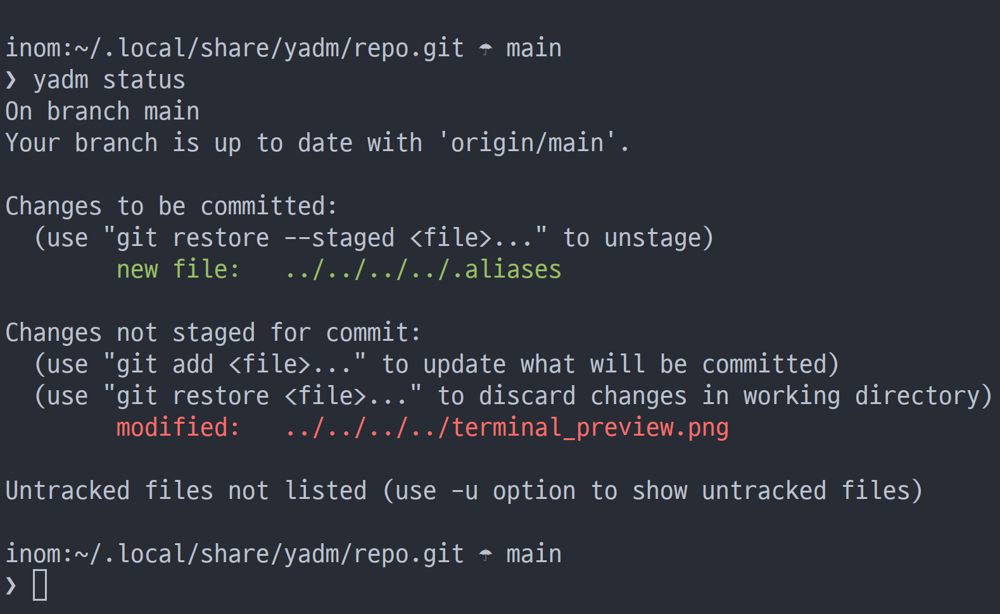

# Inomoz's Dotfile



## Quickstart
https://yadm.io/docs/getting_started

https://yadm.io/docs/faq

Since I use yadm config manager, need install it first and clone config repository:
```
yadm clone git@github.com:inomoz/dotfiles.git # use https if you are not owner of this repo
yadm status
```

# Features
* GNU/Linux with X11
* Bash and alacritty
* i3wm and polybar
* GTK and QT
* GNU Emacs with Doom Emacs configuration
* CLI and GUI program configurations
 
# Thanks to…
Got a lot from here:

* Mathias Bynens - https://github.com/mathiasbynens/dotfiles
* Peter Hogg - https://github.com/pigmonkey/dotfiles
* Henrik Lissner and others (emacs) - https://github.com/doomemacs/doomemacs
* Luke Smith - https://github.com/LukeSmithxyz/voidrice
* ThePrimeagen - https://github.com/ThePrimeagen ( starting point https://github.com/ThePrimeagen/.dotfiles/blob/master/zsh/.zsh_profile).
* Harry R. Schwartz - https://github.com/hrs/dotfiles
